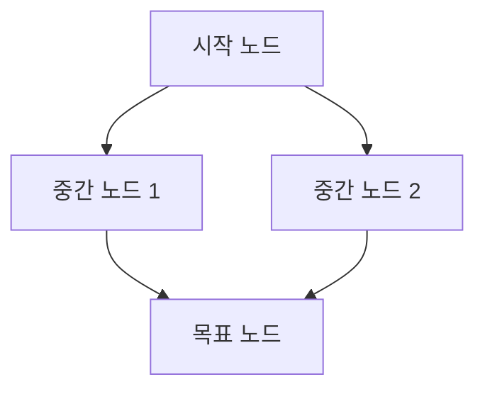
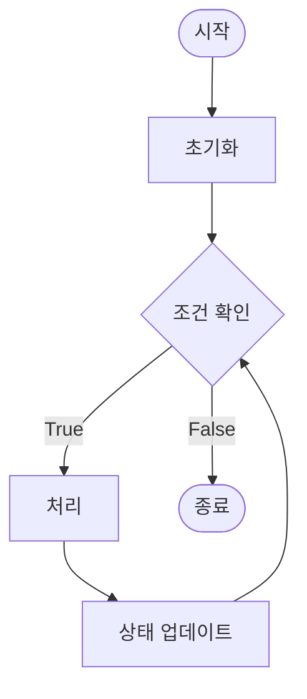
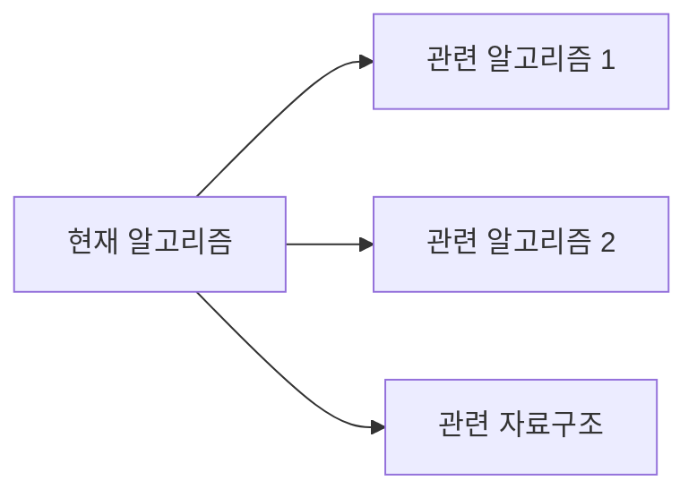

# [알고리즘명/자료구조명]

> 이 문서는 [알고리즘/자료구조명]에 대한 시각화 중심 학습 자료입니다.

## 개념 설명

### 정의
[알고리즘/자료구조가 무엇인지 간단명료하게 설명]

### 언제 사용하는가?
[이 알고리즘/자료구조를 사용하기 적합한 상황]
- 상황 1: ...
- 상황 2: ...
- 상황 3: ...

## 구조 시각화

### 전체 구조



또는

```
[ASCII Art로 구조 표현]
예시 - 이진 트리:
        10
       /  \
      5    15
     / \   / \
    3   7 12 20
```

### 주요 구성 요소

- **요소 1**: 역할과 특징
- **요소 2**: 역할과 특징
- **요소 3**: 역할과 특징

## 동작 원리

### 단계별 시각화

**Step 1: [초기 상태]**
```
[상태를 텍스트/다이어그램으로 표현]
```

**Step 2: [첫 번째 연산]**

설명: ...

**Step 3: [두 번째 연산]**
```
[변화된 상태 표현]
```
설명: ...

**Step 4: [최종 상태]**
```
[최종 결과 상태]
```

### 실행 흐름도



### 예제 실행 추적

**입력**: [예제 입력]

| 단계 | 상태 | 설명 |
|------|------|------|
| 0 | `[초기]` | 시작 상태 |
| 1 | `[변화1]` | 첫 번째 연산 후 |
| 2 | `[변화2]` | 두 번째 연산 후 |
| ... | `...` | ... |
| N | `[최종]` | 결과 상태 |

## 예제 코드 (Python)

### 핵심 구현

```python
def algorithm_name(input_data):
    """
    [알고리즘명] 구현

    시각화:
    Step 1: [설명]
    Step 2: [설명]
    Step 3: [설명]

    Args:
        input_data: 입력 데이터

    Returns:
        결과값
    """
    # 1. 초기화
    # [그림으로 표현한 초기 상태와 대응]

    # 2. 메인 로직
    # [각 단계가 위 시각화의 어느 부분에 해당하는지 주석]

    # 3. 결과 반환
    pass
```

### 단계별 주석이 포함된 상세 코드

```python
def detailed_example(arr):
    """단계별 동작을 주석으로 상세히 설명"""

    # Step 1: 초기화
    # 시각화: [초기 상태]
    result = []

    # Step 2: 순회
    for i in range(len(arr)):
        # 시각화: i번째에서 [어떤 상태]
        # 현재 보고 있는 위치를 그림으로 표현하면:
        # [그림 설명]

        # Step 3: 처리
        pass

    return result
```

## 시간/공간 복잡도

### 시간 복잡도 분석

**복잡도**: O(...)

**단계별 분석**:
| 단계 | 연산 횟수 | 설명 |
|------|-----------|------|
| 초기화 | O(...) | ... |
| 메인 로직 | O(...) | ... |
| 후처리 | O(...) | ... |
| **전체** | **O(...)** | 주요 병목 구간 |

### 공간 복잡도 분석

**복잡도**: O(...)

**메모리 사용 시각화**:
```
Stack:   [...]
Heap:    [...]
추가 DS: [...]
```

## 관련 문제 추천

### 프로그래머스

1. **[문제명]** (Level X)
   - 링크: https://school.programmers.co.kr/learn/courses/30/lessons/XXXXX
   - 난이도: ⭐⭐⭐
   - **시각화 포인트**: [이 문제에서 어떤 부분을 그려보면 좋은지]
   - 핵심: ...

2. **[문제명]** (Level X)
   - 링크: ...
   - 난이도: ...
   - **시각화 포인트**: ...
   - 핵심: ...

### 백준

1. **[문제 번호] - [문제명]**
   - 링크: https://www.acmicpc.net/problem/XXXX
   - 난이도: [실버/골드 X]
   - **시각화 포인트**: ...
   - 핵심: ...

## 학습 팁

### 시각화 연습 방법

📊 **손으로 그려보기**
1. 종이에 문제 입력 상태 그리기
2. 각 단계마다 변화 과정 그리기
3. 최종 결과까지 추적
4. 코드와 그림을 매칭

### 주의사항

⚠️ **시각화 시 실수하기 쉬운 부분**
- 실수 1: ...
- 실수 2: ...
- 실수 3: ...

### 디버깅 시각화

🐛 **막힐 때 그려볼 것들**
- [ ] 현재 데이터 구조 상태
- [ ] 포인터/인덱스 위치
- [ ] 각 변수의 값
- [ ] 예상 결과 vs 실제 결과

### 변형 패턴

🔄 **구조를 변형하면**
- 변형 1: [다른 구조로 표현하면...]
- 변형 2: [역방향으로 진행하면...]

## 인터랙티브 학습

### 직접 그려보기 체크리스트

**예제 입력**: [구체적인 입력]

- [ ] Step 1: 초기 상태를 종이에 그렸나요?
- [ ] Step 2: 첫 연산 후 변화를 그렸나요?
- [ ] Step 3: 각 단계의 변화를 추적했나요?
- [ ] Step 4: 최종 결과가 예상과 일치하나요?

### 시각화 도구 추천

- **온라인 도구**:
  - [Visualgo](https://visualgo.net/) - 알고리즘 시각화
  - [Graph Editor](https://csacademy.com/app/graph_editor/) - 그래프 그리기

- **직접 그리기 도구**:
  - Excalidraw
  - draw.io

## 관련 개념

### 연관 알고리즘/자료구조



- **[관련 개념 1]**: 어떤 관계인지...
- **[관련 개념 2]**: 어떤 관계인지...

---

**작성일**: YYYY-MM-DD
**마지막 수정**: YYYY-MM-DD

**학습 방법**: 반드시 손으로 그려보며 학습하세요!
