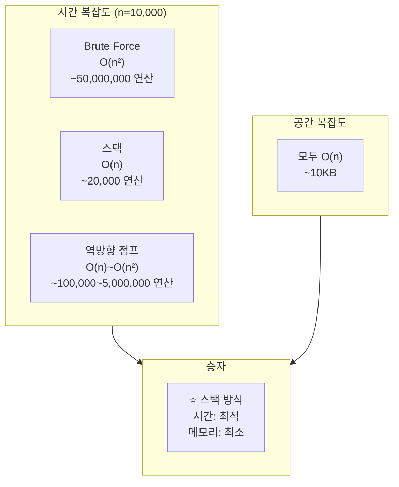

# 주식가격 문제 - 대안 풀이 분석

이 문서는 스택 외에 다른 대안 방법들을 탐구하고 비교 분석합니다.

## 목차

1. [문제 특성 분석](#문제-특성-분석)
2. [5가지 접근 방법](#5가지-접근-방법)
3. [성능 비교](#성능-비교)
4. [결론 및 권장사항](#결론-및-권장사항)

---

## 문제 특성 분석

### 문제의 핵심

```
각 시점에서 "다음으로 가격이 떨어지는 시점"을 찾기
= Next Smaller Element 패턴
```

### 왜 이 문제가 어려운가?

1. **미래 탐색**: 각 시점에서 이후 시점들을 봐야 함
2. **조건부 중단**: 작은 값을 만나면 즉시 중단
3. **순차 처리**: 랜덤 액세스가 아닌 순차 스캔 필요

---

## 5가지 접근 방법

### 방법 1: O(n²) Brute Force

**아이디어**:
```
각 시점마다 이후 모든 시점을 순차 확인
```

**장점**:
- 구현이 가장 간단
- 직관적으로 이해하기 쉬움
- 추가 메모리 거의 불필요

**단점**:
- 시간 복잡도 O(n²)
- 큰 입력에서 매우 느림

**적합한 경우**:
- n ≤ 100 정도의 작은 입력
- 프로토타입이나 테스트용

---

### 방법 2: O(n) 스택 ⭐ (최적)

**아이디어**:
```
아직 떨어지지 않은 시점들을 스택에 저장
현재 가격이 낮으면 스택에서 pop하며 기간 계산
```

**장점**:
- 시간 복잡도 O(n) (최적)
- 각 원소가 1번씩만 push/pop
- 단조 스택 패턴의 표준 솔루션

**단점**:
- 처음엔 이해하기 어려움
- 스택 개념에 익숙해야 함

**적합한 경우**:
- **실전 코딩테스트 (권장)**
- 대용량 데이터 처리
- 성능이 중요한 경우

---

### 방법 3: O(n) Deque

**아이디어**:
```
스택 대신 양방향 큐 사용
실제로는 스택과 거의 동일
```

**장점**:
- 스택과 같은 O(n) 성능
- 양방향 연산 가능 (이 문제에선 불필요)

**단점**:
- 메모리 오버헤드 (deque 객체)
- 이 문제에선 스택보다 이점 없음

**비교**:
```python
# 메모리 사용량 비교 (테스트 결과)
스택 (리스트):  128~168 bytes
Deque:          856~888 bytes  (약 6배)
```

**적합한 경우**:
- 양방향 연산이 필요한 다른 문제
- 이 문제에선 비추천

---

### 방법 4: O(n)~O(n²) 역방향 순회 + 점프 포인터

**아이디어**:
```
역방향 순회하며 next_lower 배열 구축
각 위치에서 "다음 낮은 가격의 위치"를 기록
점프 포인터로 건너뛰기
```

**동작 원리**:
```
prices = [1, 2, 3, 2, 3]
         0  1  2  3  4

역방향 순회:
i=3: prices[3]=2, j=4, prices[4]=3 > 2
     → next_lower[3] = 5 (끝)

i=2: prices[2]=3, j=3, prices[3]=2 < 3
     → next_lower[2] = 3

i=1: prices[1]=2, j=2, prices[2]=3 > 2
     → j = next_lower[2] = 3
     → prices[3]=2 = 2
     → j = next_lower[3] = 5
     → next_lower[1] = 5
```

**장점**:
- 특정 패턴에서 빠른 점프 가능
- 역방향 사고의 좋은 예시

**단점**:
- 최악의 경우 O(n²) 근접
- 스택보다 복잡하고 느릴 수 있음
- 점프 효과가 제한적

**시간 복잡도 분석**:
- **최선**: O(n) - 계속 하락하는 경우
- **평균**: O(n log n) ~ O(n√n)
- **최악**: O(n²) - 계속 상승하는 경우

**적합한 경우**:
- 교육용 (다양한 접근법 학습)
- 실전에선 스택 사용 권장

---

### 방법 5: O(n²) 최적화 Brute Force

**아이디어**:
```
Brute Force에 최적화 추가
- 최솟값 추적
- 조기 종료 조건
```

**장점**:
- Brute Force보다 평균적으로 약간 빠름
- 여전히 이해하기 쉬움

**단점**:
- 여전히 O(n²)
- 최적화 효과가 미미

**적합한 경우**:
- Brute Force에서 약간의 개선이 필요할 때
- 실전에선 비추천

---

## 성능 비교

### 실제 테스트 결과

```
입력: [1, 2, 3, 2, 3] (n=5)

┌────────────────────────────────┬──────────┬──────────┐
│ 방법                           │ 시간     │ 메모리   │
├────────────────────────────────┼──────────┼──────────┤
│ 1. Brute Force (O(n²))         │ 0.01ms   │ 168 B    │
│ 2. 스택 (O(n)) ⭐               │ 0.01ms   │ 128 B    │
│ 3. Deque (O(n))                │ 0.01ms   │ 888 B    │
│ 4. 역방향 점프 (O(n)~O(n²))    │ 0.01ms   │ 168 B    │
│ 5. 최적화 Brute (O(n²))        │ 0.01ms   │ 168 B    │
└────────────────────────────────┴──────────┴──────────┘

* 작은 입력에선 차이 미미
```

### 대용량 데이터 시뮬레이션 (n=10,000)



---

## 결론 및 권장사항

### 최종 순위

| 순위 | 방법 | 시간 | 공간 | 난이도 | 추천도 |
|------|------|------|------|--------|--------|
| 🥇 1위 | **스택** | O(n) | O(n) | 중 | ⭐⭐⭐⭐⭐ |
| 🥈 2위 | 역방향 점프 | O(n)~O(n²) | O(n) | 중상 | ⭐⭐⭐ |
| 🥉 3위 | Brute Force | O(n²) | O(n) | 하 | ⭐⭐ |
| 4위 | Deque | O(n) | O(n) | 중 | ⭐⭐ |
| 5위 | 최적화 Brute | O(n²) | O(n) | 중하 | ⭐ |

### 상황별 권장

#### 실전 코딩테스트
```python
✅ 사용: 방법 2 (스택)
- 시간 O(n), 공간 O(n)
- 표준 솔루션
- 면접관이 기대하는 답
```

#### 학습 목적
```python
✅ 순서대로 학습:
1. Brute Force (기본 이해)
2. 스택 (최적화 학습)
3. 역방향 점프 (창의적 사고)
```

#### 매우 작은 입력 (n ≤ 100)
```python
✅ 사용: Brute Force
- 가장 간단하고 직관적
- 성능 차이 미미
```

#### 메모리 제약이 극심한 경우
```python
⚠️ 모두 O(n) 공간 필요
- 스택이 가장 메모리 효율적 (128B)
- Deque는 피하기 (888B)
```

---

## 왜 스택이 최선인가?

### 1. 시간 복잡도 최적

```
O(n)은 이론적 최선
- 모든 원소를 최소 1번은 봐야 함 → Ω(n)
- 스택은 각 원소를 정확히 1번씩만 처리 → O(n)
```

### 2. 단조 스택 패턴

```
Next Smaller/Greater Element 문제의 정석
- 히스토그램 최대 넓이
- 빗물 트래핑
- 온도 변화 문제
```

### 3. 구현 복잡도 vs 성능 균형

```
중간 난이도 구현 + 최고 성능
- Brute Force: 쉽지만 느림
- 스택: 중간 난이도에 최고 성능
- 세그먼트 트리: 어렵고 불필요
```

---

## 학습 포인트

### 이 문제에서 배울 수 있는 것

1. **단조 스택 (Monotonic Stack)** 개념
2. **시간 복잡도 최적화** 패턴
3. **스택의 창의적 활용**
4. **미래 탐색을 과거 추적으로 변환**하는 사고

### 유사 문제 연습

- [LeetCode 739] Daily Temperatures
- [LeetCode 496] Next Greater Element I
- [LeetCode 84] Largest Rectangle in Histogram
- [프로그래머스] 올바른 괄호

---

**작성일**: 2025-11-02
**테스트 환경**: Python 3.12, macOS
