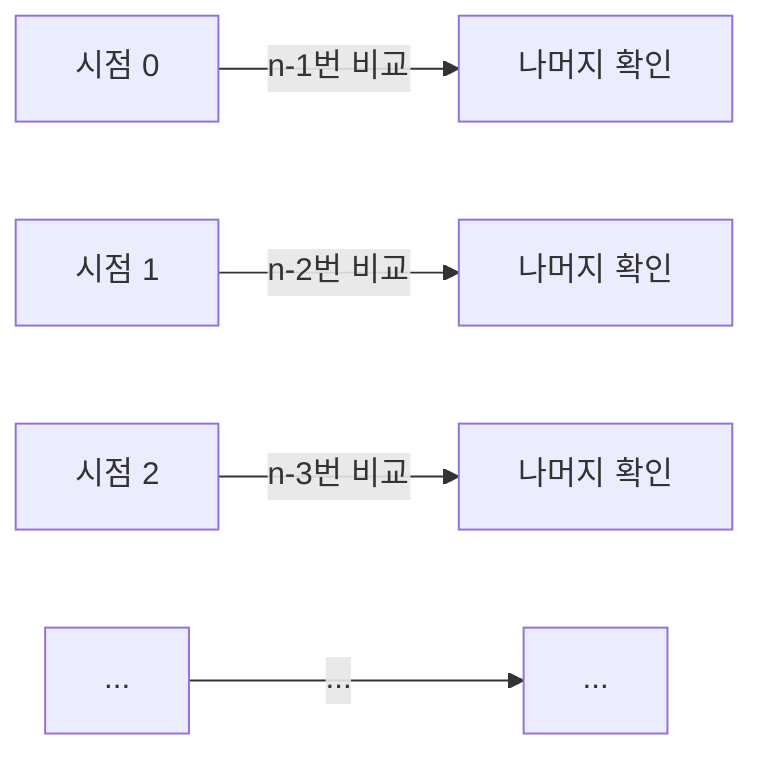
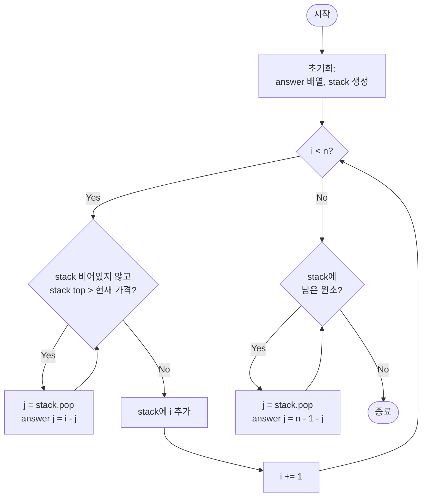
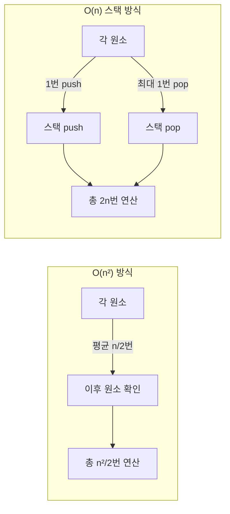
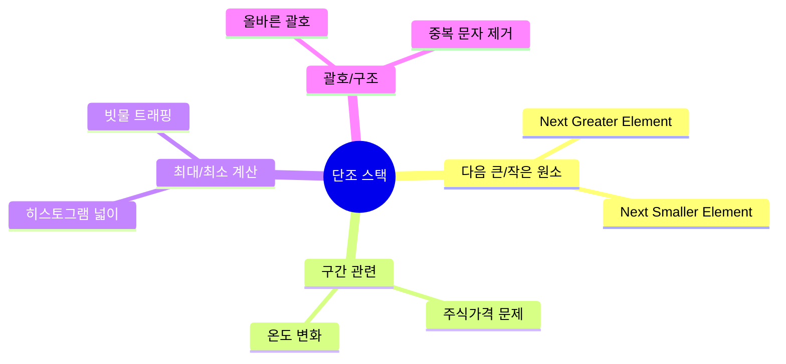

# 주식가격

- 링크: https://school.programmers.co.kr/learn/courses/30/lessons/42584

#스택 #시간복잡도최적화 #O(n)

## 문제 요약

초 단위로 기록된 주식가격이 담긴 배열 `prices`가 주어질 때, 각 시점에서 **가격이 떨어지지 않은 기간**을 계산하는 문제.

**예시**:
```
prices = [1, 2, 3, 2, 3]
answer = [4, 3, 1, 1, 0]

설명:
- 1초: 4초간 가격이 떨어지지 않음 (1→2→3→2→3)
- 2초: 3초간 가격이 떨어지지 않음 (2→3→2→3)
- 3초: 1초 후 가격이 떨어짐 (3→2)
- 4초: 1초간 가격이 떨어지지 않음 (2→3)
- 5초: 마지막이므로 0초
```

---

## 풀이 과정

### 핵심 아이디어

**문제의 본질**:
> 각 시점에서 "언제 가격이 떨어지는가?"를 찾는 것

**두 가지 접근 방식**:
1. **O(n²)**: 각 시점마다 이후 모든 시점을 확인 (단순하지만 느림)
2. **O(n)**: 스택을 이용해 "떨어지지 않은 시점들"만 추적 (최적화)

### 왜 스택을 사용하는가?

**핵심 통찰**:
> 가격이 떨어지는 순간, **과거의 모든 높은 가격들이 동시에 확정**된다

```
예: [1, 2, 3, 2]
         ↑   ↑
        3초  여기서 2가 나오면
             "3"의 떨어진 시점 확정!
```

**스택의 역할**:
- **저장**: 아직 가격이 떨어지지 않은 시점의 인덱스
- **특성**: 스택 내부는 가격 오름차순 유지
- **처리**: 현재 가격이 낮으면 스택에서 pop하며 기간 계산

---

## 방법 1: O(n²) Brute Force

### 접근 방법

1. 각 시점 `i`에서 시작
2. 이후 시점 `j`를 하나씩 순회
3. `prices[i] > prices[j]`이면 중단
4. 순회한 횟수가 떨어지지 않은 기간

### 코드

```python
def solution_n2(prices):
    n = len(prices)
    answer = [0] * n

    for i in range(n):
        for j in range(i + 1, n):
            answer[i] += 1
            if prices[i] > prices[j]:
                break

    return answer
```

### 시간 복잡도 분석



- **최악의 경우**: 모든 시점에서 끝까지 확인
- **연산 횟수**: n + (n-1) + (n-2) + ... + 1 = **O(n²)**

---

## 방법 2: O(n) 스택 최적화 ⭐

### 접근 방법

1. 스택에 **아직 가격이 떨어지지 않은 시점의 인덱스** 저장
2. 현재 가격이 스택 top보다 낮으면:
   - 스택 top의 가격이 "드디어 떨어진 것"
   - pop하고 `answer[top] = 현재시점 - top`
3. 현재 인덱스를 스택에 push
4. 반복 종료 후 스택에 남은 시점들은 끝까지 안 떨어진 것

### 알고리즘 흐름도



### 코드

```python
def solution(prices):
    n = len(prices)
    answer = [0] * n
    stack = []

    for i in range(n):
        # 현재 가격이 스택 top보다 낮으면
        # = 스택에 있는 시점의 가격이 떨어진 것!
        while stack and prices[stack[-1]] > prices[i]:
            j = stack.pop()
            answer[j] = i - j

        stack.append(i)

    # 스택에 남은 시점들은 끝까지 안 떨어진 것
    while stack:
        j = stack.pop()
        answer[j] = n - 1 - j

    return answer
```

---

## 스택 동작 과정 시각화

`prices = [1, 2, 3, 2, 3]` 예시:

```mermaid
graph TB
    subgraph Step1["i=0: price=1"]
        S1[stack: []]
        S1 --> S1_1[push 0]
        S1_1 --> S1_2[stack: [0]]
    end

    subgraph Step2["i=1: price=2"]
        S2[stack: [0]]
        S2 --> S2_1["prices[0]=1 < 2 ✓"]
        S2_1 --> S2_2[push 1]
        S2_2 --> S2_3[stack: [0,1]]
    end

    subgraph Step3["i=2: price=3"]
        S3[stack: [0,1]]
        S3 --> S3_1["prices[1]=2 < 3 ✓"]
        S3_1 --> S3_2[push 2]
        S3_2 --> S3_3[stack: [0,1,2]]
    end

    subgraph Step4["i=3: price=2 ⭐"]
        S4[stack: [0,1,2]]
        S4 --> S4_1["prices[2]=3 > 2 ✗<br/>pop! answer[2]=3-2=1"]
        S4_1 --> S4_2["prices[1]=2 = 2 ✓"]
        S4_2 --> S4_3[push 3]
        S4_3 --> S4_4[stack: [0,1,3]]
    end

    subgraph Step5["i=4: price=3"]
        S5[stack: [0,1,3]]
        S5 --> S5_1["prices[3]=2 < 3 ✓"]
        S5_1 --> S5_2[push 4]
        S5_2 --> S5_3[stack: [0,1,3,4]]
    end

    subgraph Final["반복 종료 후"]
        F1[stack: [0,1,3,4]]
        F1 --> F2[answer[4] = 4-4 = 0]
        F2 --> F3[answer[3] = 4-3 = 1]
        F3 --> F4[answer[1] = 4-1 = 3]
        F4 --> F5[answer[0] = 4-0 = 4]
        F5 --> F6["최종: [4,3,1,1,0]"]
    end

    Step1 --> Step2
    Step2 --> Step3
    Step3 --> Step4
    Step4 --> Step5
    Step5 --> Final
```

### 핵심 순간 상세 분석 (i=3, price=2)

```
스택 상태: [0, 1, 2]
           [1, 2, 3] (가격)
                 ↓
현재 가격 2를 만남
                 ↓
prices[2]=3 > 2 → 떨어짐!
                 ↓
pop(2), answer[2] = 3-2 = 1
                 ↓
prices[1]=2 = 2 → 안 떨어짐
                 ↓
push(3), stack: [0, 1, 3]
```

---

## 시간 복잡도 비교



| 방식 | 시간 복잡도 | 공간 복잡도 | n=10,000 연산 횟수 |
|------|-------------|-------------|-------------------|
| Brute Force | O(n²) | O(n) | ~50,000,000 |
| 스택 | O(n) | O(n) | ~20,000 |

**왜 O(n)인가?**
- 각 원소가 스택에 **정확히 1번 push**
- 각 원소가 스택에서 **최대 1번 pop**
- 총 연산: push(n) + pop(≤n) = **O(2n) = O(n)**

---

## 스택 불변성 (Invariant)

스택은 항상 다음 조건을 만족:

```
stack = [i₁, i₂, i₃, ...]
       ↓
prices[i₁] ≤ prices[i₂] ≤ prices[i₃] ≤ ...
(오름차순 또는 같음)
```

**증명**:
1. 새 원소 push 전: `prices[stack[-1]] ≤ prices[i]`인 상태까지 pop
2. 따라서 push 후에도 오름차순 유지
3. 이 성질 덕분에 while문이 필요한 만큼만 pop 수행

---

## 회고

### 배운 점

1. **스택의 활용 패턴**: "아직 처리되지 않은 것들" 추적에 스택이 유용
   - 히스토그램 최대 넓이
   - 다음 큰/작은 원소 찾기
   - 괄호 매칭 등

2. **시간 복잡도 최적화의 핵심**: 중복 연산 제거
   - O(n²): 매번 전체 확인 (중복 많음)
   - O(n): 필요한 것만 확인 (중복 없음)

3. **단조 스택 (Monotonic Stack)** 개념
   - 스택 내부가 특정 순서(오름/내림차순)를 유지
   - 비교 연산을 효율적으로 만듦

### 어려웠던 부분

1. **"떨어지지 않은 기간"을 스택으로 측정한다는 발상**
   - 처음엔 직관적이지 않음
   - "과거를 추적한다"는 역발상이 필요

2. **while문 종료 조건 이해**
   - `prices[stack[-1]] > prices[i]`가 거짓일 때 멈춤
   - 즉, 현재 가격 이하인 시점들만 스택에 남김

3. **반복문 종료 후 스택 처리**
   - 남은 원소들은 끝까지 가격이 안 떨어진 것
   - `n-1-j`로 계산하는 이유 이해

### 개선할 점

1. **공간 복잡도 추가 최적화 불가능**
   - 스택 크기는 최악의 경우 O(n) (계속 상승하는 경우)
   - 하지만 시간 복잡도를 O(n)으로 만들기 위해 필수적

2. **다른 유사 문제 연습 필요**
   - "다음 큰 수" 문제
   - "히스토그램 최대 넓이" 문제
   - 스택 패턴 익히기

---

## 다른 응용 방안

### 유사 문제 패턴

**단조 스택을 사용하는 문제들**:



### 실전 활용

1. **주식 차트 분석**: 가격 하락 구간 탐지
2. **타임시리즈 데이터**: 추세 변화 지점 찾기
3. **알고리즘 최적화**: O(n²) → O(n) 변환 패턴

---

**복잡도**:
- Brute Force: O(n²) 시간, O(n) 공간
- 스택 최적화: O(n) 시간, O(n) 공간

**풀이 날짜**: 2025-11-02
