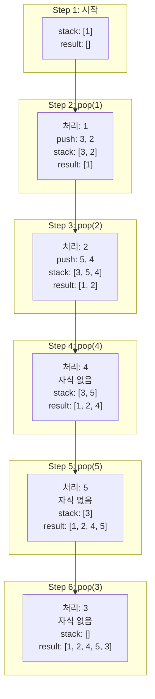
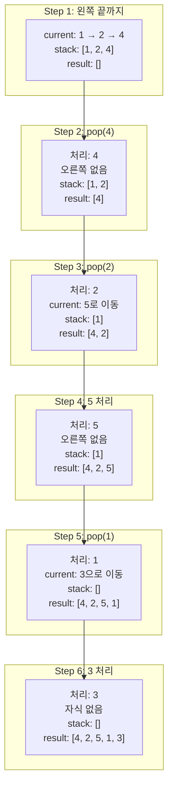
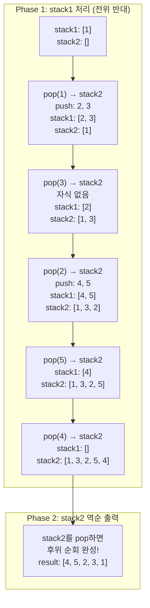

# 트리 순회

- 링크 : [프로그래머스 PCCP 모의고사 2회 1번](https://school.programmers.co.kr/learn/courses/15008/lessons/121685)

```
#트리 #재귀 #전위순회 #중위순회 #후위순회 #클로저
```

## 풀이 과정

### 핵심 아이디어
- 배열로 표현된 완전 이진 트리에서 인덱스 관계를 활용
- 인덱스 `i`의 왼쪽 자식: `2*i + 1`, 오른쪽 자식: `2*i + 2`
- 각 순회 방식은 방문 순서만 다름 (루트-왼-오 vs 왼-루트-오 vs 왼-오-루트)
- 클로저를 활용하여 result 리스트를 캡처

### 접근 방법
1. 각 순회 방식별로 함수 분리 (preorder, inorder, postorder)
2. 내부 헬퍼 함수(inner)를 클로저로 구현하여 result 공유
3. 재귀 종료 조건: 인덱스가 배열 범위를 벗어나면 종료
4. 각 순회 방식에 맞게 노드 방문 순서 조정
   - 전위: 현재 → 왼쪽 → 오른쪽
   - 중위: 왼쪽 → 현재 → 오른쪽
   - 후위: 왼쪽 → 오른쪽 → 현재

### 코드

```python
def preorder(nodes):
    result = []
    def inner(idx):
        if idx >= len(nodes):
            return
        result.append(str(nodes[idx]))
        inner(idx*2 + 1)
        inner(idx*2 + 2)
    inner(0)
    return " ".join(result)

def inorder(nodes):
    result = []
    def inner(idx):
        if idx >= len(nodes):
            return
        inner(idx*2 + 1)
        result.append(str(nodes[idx]))
        inner(idx*2 + 2)
    inner(0)
    return " ".join(result)

def postorder(nodes):
    result = []
    def inner(idx):
        if idx >= len(nodes):
            return
        inner(idx*2 + 1)
        inner(idx*2 + 2)
        result.append(str(nodes[idx]))
    inner(0)
    return " ".join(result)

def solution(nodes):
    return [
        preorder(nodes),
        inorder(nodes),
        postorder(nodes)
    ]
```

## 회고

### 배운 점
- python에서도 람다 함수에 클로저를 사용할 수 있다는 것을 알게 되었다.

### 어려웠던 부분
- 전위, 중위, 후위 순회 방식을 헷갈려서 어려웠다.
- python에서 재귀 함수 인자가 클래스인 경우 레퍼런스 인지 값 복사인지 헷갈렸다.
- 재귀 함수를 오랜만에 사용해서 작성하는 방법을 잊어버렸다.

### 개선할 점
- 트리 순회 방식을 확실히 익히자.

## 평가

### 개선할 점

**1. 불필요한 str() 변환 시점**
- `result.append(str(nodes[idx]))`를 매번 호출하는 것보다
- `" ".join(map(str, result))`로 마지막에 한 번만 변환하는 것이 더 효율적입니다.

```python
def preorder(nodes):
    result = []
    def inner(idx):
        if idx >= len(nodes):
            return
        result.append(nodes[idx])  # 정수 그대로 저장
        inner(idx*2 + 1)
        inner(idx*2 + 2)
    inner(0)
    return " ".join(map(str, result))  # 마지막에 한 번만 변환
```

**2. 함수명 개선 (선택사항)**
- `inner`보다 `traverse` 또는 `visit`이 의미를 더 명확히 전달합니다.
- 하지만 **현재도 충분히 명확**하므로 우선순위는 낮습니다.

**❌ 피해야 할 것: 과도한 통합**
- 세 함수가 비슷해 보여도 **각각 독립적으로 두는 것이 낫습니다**.
- 하나로 통합하면 오히려 각 순회의 **논리적 구조가 불명확**해집니다:

```python
# ❌ 나쁜 예: 순회 패턴이 if문으로 흩어짐
def traverse(nodes, mode):
    def inner(idx):
        if mode == 'preorder': result.append(...)  # 🚨 분산
        inner(idx*2 + 1)
        if mode == 'inorder': result.append(...)   # 🚨 분산
        inner(idx*2 + 2)
        if mode == 'postorder': result.append(...) # 🚨 분산
```

현재 구조가 더 좋습니다:
- ✅ 전위/중위/후위의 **차이가 한눈에 보임**
- ✅ 각 순회의 **본질적 구조를 정확히 표현**
- ✅ **교육적으로 우수** (학습용 코드)

### 잘한 점

**1. 클로저 활용 ✨**
- 클로저를 사용하여 result 리스트를 캡처한 점이 매우 좋습니다.
- 함수 시그니처가 간결해지고 가독성이 향상되었습니다.
- 레퍼런스 전달로 인한 실수를 방지할 수 있습니다.

**2. 함수 분리**
- 각 순회 방식을 별도 함수로 분리하여 책임이 명확합니다.
- solution() 함수의 의도가 한눈에 파악됩니다.

**3. 정확한 인덱스 계산**
- 배열 기반 완전 이진 트리의 인덱스 관계를 정확히 이해하고 구현했습니다.
- `2*i + 1` (왼쪽 자식), `2*i + 2` (오른쪽 자식)

**4. 적절한 종료 조건**
- `idx >= len(nodes)` 조건으로 범위 체크를 명확히 했습니다.

### 다른 응용 방안

**1. 레벨 순서 순회 (Level Order Traversal)**
- BFS를 활용한 층별 순회 추가 가능
```python
from collections import deque

def levelorder(nodes):
    if not nodes:
        return ""

    result = []
    queue = deque([0])  # 루트 인덱스

    while queue:
        idx = queue.popleft()
        if idx < len(nodes):
            result.append(str(nodes[idx]))
            queue.append(2*idx + 1)  # 왼쪽 자식
            queue.append(2*idx + 2)  # 오른쪽 자식

    return " ".join(result)
```

**2. 반복적(Iterative) 구현**
- 스택을 사용한 비재귀 버전 구현 가능 (콜스택 깊이 제한 회피)

**3. 제너레이터 활용**
- 메모리 효율을 위해 yield를 사용한 제너레이터 패턴 적용 가능

**4. 불완전 이진 트리 지원**
- None 값을 포함한 배열 처리 (현재는 완전 이진 트리만 지원)

### 다른 추천 문제

**기본 트리 순회 문제**
- [백준 1991 - 트리 순회](https://www.acmicpc.net/problem/1991)
  - 난이도: 실버 1
  - 노드 클래스 기반 트리 구현 연습

**트리 응용 문제**
- [프로그래머스 - 길 찾기 게임](https://school.programmers.co.kr/learn/courses/30/lessons/42892)
  - Level 3
  - 좌표로 주어진 노드들을 이진 탐색 트리로 구성 후 순회

- [백준 11725 - 트리의 부모 찾기](https://www.acmicpc.net/problem/11725)
  - 실버 2
  - 트리 구조 파악 및 부모-자식 관계 이해

**심화 문제**
- [백준 5639 - 이진 검색 트리](https://www.acmicpc.net/problem/5639)
  - 골드 4
  - 전위 순회 결과로 후위 순회 결과 구하기

- [프로그래머스 - 양과 늑대](https://school.programmers.co.kr/learn/courses/30/lessons/92343)
  - Level 3
  - 트리 순회 + 백트래킹 조합

### 종합 평가

이 풀이는 **트리 순회의 기본 개념을 정확히 이해**하고 있으며, **클로저를 활용한 깔끔한 구현**이 돋보입니다. 특히 배열 기반 완전 이진 트리의 인덱스 관계를 정확히 파악하고 재귀로 구현한 점이 우수합니다.

**구조적 선택의 적절성:**
- 세 개의 순회 함수를 독립적으로 유지한 것은 **올바른 선택**입니다.
- 각 순회 방식의 **논리적 구조가 명확**하게 드러나 교육적으로 우수합니다.
- 과도한 통합은 오히려 알고리즘의 본질을 흐릴 수 있습니다.

미세한 개선 여지는 **str() 변환 시점** 정도입니다. 매번 append 시 변환하기보다 마지막에 `map(str, result)`를 사용하면 약간 더 효율적입니다. 하지만 이는 마이크로 최적화 수준이고, 현재 코드도 충분히 명확하고 효율적입니다.

**학습 관점에서의 평가:**
- ✅ 전위/중위/후위 순회 개념을 명확히 이해
- ✅ 재귀의 기본 패턴(종료 조건 + 재귀 호출) 숙지
- ✅ 파이썬 클로저 활용 능력 향상
- ✅ **알고리즘의 의미를 코드 구조로 표현** (각 순회의 차이가 명확)

트리 구조의 기초를 다지는 **몸풀기 문제로서 완벽히 목표를 달성**했습니다. 코드의 가독성과 의미 전달력이 뛰어나며, 학습용 구현으로서 모범적입니다. 다음 단계로는 노드 클래스 기반 트리 구현, 불완전 트리 처리, 그리고 트리 순회를 활용한 복잡한 문제 해결로 나아가시길 추천합니다.

## 추가 학습

### 배열 vs 노드 기반 트리 구현

**배열 기반 (현재 문제)**
```python
# 인덱스 관계만으로 트리 구조 표현
tree = [1, 2, 3, 4, 5, 6, 7]
left_child = 2*i + 1
right_child = 2*i + 2
```
- 장점: 간단, 메모리 연속적, 캐시 친화적
- 단점: 불완전 트리 표현 비효율, 중간 삽입/삭제 어려움

**노드 기반 (일반적인 트리)**
```python
class TreeNode:
    def __init__(self, val):
        self.val = val
        self.left = None
        self.right = None

def inorder(node):
    if not node:
        return
    inorder(node.left)
    print(node.val)
    inorder(node.right)
```
- 장점: 불완전 트리 표현 자유로움, 동적 구조 변경 용이
- 단점: 포인터 오버헤드, 메모리 분산

### 순회 방식별 활용 사례

**전위 순회 (Preorder)**: 루트 → 왼쪽 → 오른쪽
- 트리 복사
- 트리 직렬화/역직렬화
- 디렉토리 구조 출력 (파일 시스템)

**중위 순회 (Inorder)**: 왼쪽 → 루트 → 오른쪽
- 이진 탐색 트리(BST)의 정렬된 순서 출력
- 수식 트리의 중위 표기법 변환

**후위 순회 (Postorder)**: 왼쪽 → 오른쪽 → 루트
- 트리 삭제 (자식부터 삭제 후 부모)
- 디렉토리 크기 계산
- 수식 트리 계산 (후위 표기법)

### 재귀 깊이 제한 주의

파이썬의 기본 재귀 깊이는 **약 1000**입니다. 깊은 트리의 경우:
```python
import sys
sys.setrecursionlimit(10000)  # 재귀 깊이 증가

# 또는 반복문으로 구현 (스택 사용)
def iterative_preorder(nodes):
    if not nodes:
        return ""

    result = []
    stack = [0]  # 루트 인덱스

    while stack:
        idx = stack.pop()
        if idx < len(nodes):
            result.append(str(nodes[idx]))
            # 오른쪽 먼저 push (스택 LIFO 특성)
            if 2*idx + 2 < len(nodes):
                stack.append(2*idx + 2)
            if 2*idx + 1 < len(nodes):
                stack.append(2*idx + 1)

    return " ".join(result)
```

### 반복문 순회가 어려운 이유와 시각화

#### 왜 반복문이 재귀보다 어려운가?

**재귀는 "자연스럽다"**
- 함수 호출 = 트리 탐색
- 컴파일러가 자동으로 콜스택 관리
- "어디로 돌아가야 하는지" 자동 기억
```python
def preorder(node):
    print(node)      # 루트
    preorder(left)   # 왼쪽 (자동으로 여기로 돌아옴)
    preorder(right)  # 오른쪽
```

**반복문은 "수동"**
- 스택을 명시적으로 조작
- "언제 노드를 처리할지" 타이밍을 수동으로 제어
- 특히 중위/후위는 **"자식을 먼저 보고 나중에 처리"**해야 해서 복잡

#### 트리 구조 (예시)
```
      1
     / \
    2   3
   / \
  4   5

배열: [1, 2, 3, 4, 5]
```

#### 전위 순회 (Preorder) 스택 변화

**전략**: 루트 즉시 처리 → 오른쪽 먼저 push (LIFO)



**핵심**:
- ✅ pop하자마자 즉시 처리
- ✅ 오른쪽을 먼저 push → LIFO로 왼쪽이 먼저 처리됨

#### 중위 순회 (Inorder) 스택 변화

**전략**: 왼쪽 끝까지 push → pop하며 처리 → 오른쪽으로



**핵심**:
- ⚠️ 왼쪽 끝까지 내려가며 스택에 쌓음
- ⚠️ pop할 때 처리 (왼쪽 자식들을 먼저 본 후)
- ⚠️ 그 다음 오른쪽 서브트리로 이동

#### 후위 순회 (Postorder) 스택 변화 - 두 스택 방식

**전략**: 전위의 반대(루트→오→왼) 만들고 역순으로



**핵심**:
- 🎯 전위: 루트 → 왼 → 오 (1 2 4 5 3)
- 🎯 반대: 루트 → 오 → 왼 (1 3 2 5 4)
- 🎯 역순: **왼 → 오 → 루트 (4 5 2 3 1)** ✅

#### 비교 요약

| 순회 | 노드 처리 타이밍 | 난이도 | 핵심 트릭 |
|------|-----------------|--------|----------|
| **전위** | pop 즉시 처리 | ⭐ 쉬움 | 오른쪽 먼저 push |
| **중위** | 왼쪽 끝 도달 후 | ⭐⭐ 중간 | 왼쪽 끝까지 내려가기 |
| **후위** | 양쪽 자식 처리 후 | ⭐⭐⭐ 어려움 | 두 스택 or 방문 플래그 |

**왜 후위가 가장 어려운가?**
- 자식들을 **먼저** 처리하고 부모를 **나중에** 처리
- "이 노드의 자식을 다 봤는지" 판단 필요
- 방문 플래그 또는 두 스택 같은 추가 장치 필요

**실전 팁**:
- 코딩테스트에서는 재귀 사용 (압도적으로 간단)
- 반복문은 재귀 깊이 제한 문제가 있을 때만
- 면접에서 반복문 구현을 물어볼 수 있으니 이해는 필요

---
**복잡도**:
- 시간: O(N) - 모든 노드를 한 번씩 방문
- 공간: O(N) - result 리스트 + O(H) 재귀 스택 (H는 트리 높이)
  - 완전 이진 트리에서 H = log N
  - 최악의 경우 (편향 트리) H = N

**풀이 날짜**: 2025-11-14
