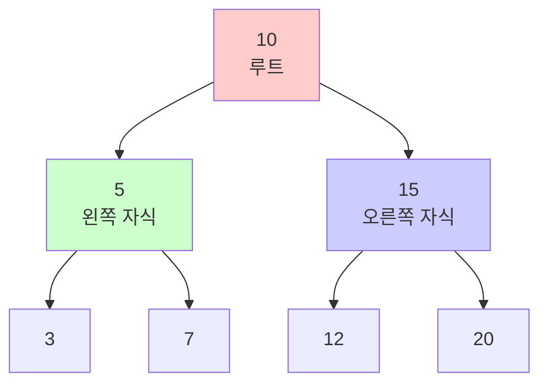
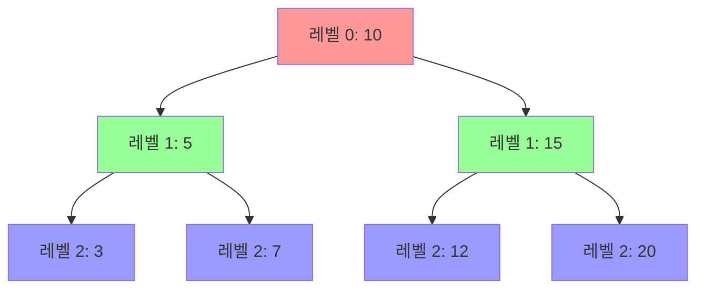

# 이진 트리 (Binary Tree)

> 대학교 학부 수준의 이진 트리 자료구조 - 이론부터 실전까지

## 들어가며

이 문서는 이진 트리를 **처음 배우는 학생의 관점**에서 작성되었습니다. 단순히 정의를 나열하는 것이 아니라, "왜 이 개념이 필요한가?", "어떻게 이해하면 좋은가?"를 중심으로 설명합니다.

**학습 목표**:
- 트리가 왜 필요한지, 그래프와 어떻게 다른지 이해
- 이진 트리의 다양한 형태와 그 특성을 시각적으로 파악
- 순회 알고리즘의 원리를 재귀적 사고로 이해
- 이론을 코드로 구현하는 방법 습득
- 코딩 테스트에서 이진 트리 문제를 해결하는 패턴 익히기

---

## 1. 트리의 기초 이론

### 1.1 왜 트리가 필요할까?

우리는 이미 배열, 리스트 같은 **선형 자료구조**를 알고 있습니다. 그런데 왜 트리가 필요할까요?

**예시 상황**: 조직도를 생각해봅시다.

```
CEO
├─ CTO
│  ├─ 개발팀장
│  └─ QA팀장
└─ CFO
   └─ 회계팀장
```

이런 **계층 구조**는 배열이나 리스트로 표현하기 어렵습니다.
- 한 사람이 여러 부하 직원을 가질 수 있음
- 상하 관계가 명확함
- 순환이 없음 (A가 B의 상사이고, B가 A의 상사일 수 없음)

이런 구조를 표현하기 위해 **트리**라는 자료구조가 등장했습니다.

### 1.2 그래프 이론 관점의 트리 정의

먼저 **그래프**를 복습해봅시다. 그래프 G = (V, E)는:
- V: 정점(Vertex)들의 집합
- E: 간선(Edge)들의 집합

**예시**:
```
V = {1, 2, 3, 4}
E = {(1,2), (2,3), (2,4)}

그림:
  1
  |
  2
 / \
3   4
```

이제 **트리**의 정의를 볼까요?

**트리(Tree)**는 다음 **세 가지 조건을 모두** 만족하는 그래프입니다:

1. **비순환성 (Acyclic)**: 사이클이 없다
   - 쉽게 말해: 한 정점에서 출발해서 다시 그 정점으로 돌아오는 경로가 없다

2. **연결성 (Connected)**: 모든 정점 쌍 사이에 경로가 존재한다
   - 쉽게 말해: 어떤 두 정점을 골라도 경로로 연결되어 있다

3. **최소 연결성**: 간선의 수 = 정점의 수 - 1
   - 수식으로: |E| = |V| - 1
   - 쉽게 말해: n개의 노드가 있으면 간선은 정확히 (n-1)개

**왜 이 세 조건이 중요할까요?**

하나씩 살펴봅시다:

**조건 1 (비순환성)**: 사이클이 있으면 무한 루프에 빠질 수 있습니다.
```
사이클 있는 경우 (트리 아님):
1 → 2 → 3
↑       ↓
└───────┘
```

**조건 2 (연결성)**: 모든 노드에 접근할 수 있어야 합니다.
```
연결되지 않은 경우 (트리 아님):
1 - 2    3 - 4
(두 개의 분리된 그래프)
```

**조건 3 (최소 연결성)**: 간선이 너무 많으면 사이클이 생기고, 너무 적으면 연결되지 않습니다.
```
4개의 노드 → 정확히 3개의 간선 필요

간선 2개 (부족):     간선 4개 (과다):
1 - 2  3 - 4        1 - 2 - 3
                    |   X   |
                    └───4───┘
```

**중요한 정리 1.1**: 다음 명제들은 **모두 같은 의미**입니다 (동치):

- G는 트리이다
- G는 연결되어 있으며 사이클이 없다
- G의 임의의 두 정점 사이에 **정확히 하나의** 경로가 존재한다
- G는 연결되어 있으며, 임의의 간선을 제거하면 연결되지 않는다
- G는 비순환이며, 간선을 하나 추가하면 사이클이 생긴다

💡 **이해를 돕는 비유**: 트리는 "꼭 필요한 다리만 있는 섬 연결망"과 같습니다. 다리가 하나라도 부족하면 고립된 섬이 생기고, 하나라도 많으면 불필요한 우회로가 생깁니다.

### 1.3 트리의 기본 용어 - 가족 관계로 이해하기

트리의 용어는 **가족 관계**에 비유하면 이해하기 쉽습니다.

```
         할아버지(루트)
            10
           /  \
       아버지  삼촌
          5    15
         / \   / \
    나  동생 사촌1 사촌2
    3    7   12   20
   /
손자
 1
```

**용어 정리**:

1. **루트 (Root)**:
   - 의미: 가장 위에 있는 노드 (할아버지)
   - 특징: 부모가 없는 **유일한** 노드
   - 예시: 위 그림에서 10

2. **부모-자식 (Parent-Child)**:
   - 의미: 간선으로 **직접** 연결된 상하 관계
   - 예시: 10(부모) ↔ 5(자식), 5(부모) ↔ 3(자식)

3. **형제 (Sibling)**:
   - 의미: **같은 부모**를 가진 노드들
   - 예시: 5와 15는 형제, 3과 7은 형제

4. **조상 (Ancestor)**:
   - 의미: 루트로 올라가는 경로상의 **모든** 노드
   - 예시: 1의 조상 = {3, 5, 10}
   - 쉽게 말해: 나의 부모, 할아버지, 증조할아버지...

5. **자손 (Descendant)**:
   - 의미: 특정 노드에서 **아래로 도달 가능한** 모든 노드
   - 예시: 5의 자손 = {3, 7, 1}
   - 쉽게 말해: 나의 자식, 손자, 증손자...

6. **리프/단말 노드 (Leaf)**:
   - 의미: **자식이 없는** 노드
   - 특징: 트리의 "끝"에 있는 노드
   - 예시: {1, 7, 12, 20}

7. **내부 노드 (Internal Node)**:
   - 의미: 루트도 리프도 **아닌** 노드
   - 특징: 위아래로 모두 연결됨
   - 예시: {5, 15, 3}

### 1.4 트리의 측정: 레벨, 깊이, 높이

이 세 개념은 **자주 헷갈리는** 용어입니다. 명확히 구분해봅시다.

#### 레벨 (Level)

**정의**: 루트로부터의 **층수**

```
레벨 0:        10         ← 루트
              /  \
레벨 1:      5    15       ← 루트의 자식들
            / \   / \
레벨 2:    3   7 12  20    ← 손자들
          /
레벨 3:  1                 ← 증손자
```

**계산 방법**:
- 루트의 레벨 = 0 (또는 1, 책마다 다름 - 보통 0 사용)
- 다른 노드의 레벨 = 부모의 레벨 + 1

**예시**:
- 10의 레벨: 0
- 5의 레벨: 1 (부모 10의 레벨 + 1)
- 3의 레벨: 2 (부모 5의 레벨 + 1)
- 1의 레벨: 3 (부모 3의 레벨 + 1)

#### 깊이 (Depth)

**정의**: **루트에서** 그 노드까지의 경로 길이 (지나는 간선의 수)

💡 **핵심**: 레벨 = 깊이 (같은 개념입니다!)

**예시**:
```
10 → 5 → 3 → 1
```
- 1까지 가려면 간선 3개를 거침 → 깊이 = 3
- 1의 레벨 = 3

#### 높이 (Height)

**정의**: 그 노드에서 **리프까지**의 최장 경로 길이

⚠️ **주의**: 높이는 **아래로 측정**합니다!

```
        10  ← 높이 3 (10→5→3→1, 간선 3개)
       /  \
      5    15  ← 5의 높이: 2 (5→3→1)
     / \   / \     15의 높이: 1 (15→20)
    3   7 12  20  ← 3의 높이: 1 (3→1)
   /                 7, 12, 20의 높이: 0 (리프)
  1  ← 1의 높이: 0 (리프)
```

**계산 방법** (재귀적):
```
height(node) = {
    0                                  (리프 노드)
    1 + max(height(왼쪽), height(오른쪽))  (내부 노드)
}
```

**예시 계산**:
- height(1) = 0 (리프)
- height(3) = 1 + max(height(1), 0) = 1 + 0 = 1
- height(5) = 1 + max(height(3), height(7)) = 1 + max(1, 0) = 2
- height(10) = 1 + max(height(5), height(15)) = 1 + max(2, 1) = 3

**트리의 높이**: 루트의 높이 = 3

### 1.5 트리 크기의 한계 - 얼마나 크거나 작을 수 있을까?

**정리 1.2**: n개의 노드를 가진 트리의 높이 h는:

```
⌈log₂(n+1)⌉ - 1 ≤ h ≤ n - 1
```

**이게 무슨 뜻일까요?**

**최소 높이** (가장 낮고 넓은 트리):
```
      1
    /   \
   2     3
  / \   / \
 4   5 6   7

n = 7개 노드
h = 2
2 = ⌈log₂(8)⌉ - 1 = 3 - 1 = 2 ✓
```
모든 레벨이 꽉 차면 가장 낮습니다.

**최대 높이** (가장 높고 좁은 트리):
```
1
 \
  2
   \
    3
     \
      4

n = 4개 노드
h = 3 = n - 1 ✓
```
일렬로 늘어서면 가장 높습니다.

💡 **실용적 의미**:
- 균형 잡힌 트리 → 높이 O(log n) → 빠른 탐색
- 편향된 트리 → 높이 O(n) → 느린 탐색

---

## 2. 이진 트리 (Binary Tree) - 본격적으로 시작

### 2.1 왜 "이진" 트리일까?

지금까지 본 트리는 자식 개수에 제한이 없었습니다. 하지만 **이진 트리**는:

**정의**: 각 노드가 **최대 2개**의 자식을 갖는 트리

**왜 2개로 제한할까요?**

1. **구현이 간단**: 왼쪽, 오른쪽 두 포인터만 있으면 됨
2. **응용이 많음**: 이진 탐색 트리, 힙, 표현식 트리 등
3. **분할정복에 적합**: 문제를 2개로 나누어 해결

### 2.2 이진 트리의 형식적 정의

**재귀적 정의**: 이진 트리 T는 다음 중 **하나**입니다:

1. **공집합** (∅) - 빈 트리
2. **튜플** (r, T_L, T_R) 형태:
   - r: 루트 노드
   - T_L: 왼쪽 서브트리 (역시 이진 트리)
   - T_R: 오른쪽 서브트리 (역시 이진 트리)

**왜 "재귀적"일까요?**

이진 트리의 정의 안에 이진 트리가 다시 등장합니다! 이것이 재귀입니다.

**예시로 이해하기**:
```
      10
     /  \
    5    15
```

이 트리는:
- 루트: 10
- 왼쪽 서브트리: (5, ∅, ∅) - 5만 있는 트리
- 오른쪽 서브트리: (15, ∅, ∅) - 15만 있는 트리

전체: (10, (5, ∅, ∅), (15, ∅, ∅))

**중요한 특징**: 왼쪽과 오른쪽이 **구별됩니다**!

```
트리 A:    트리 B:
   10        10
  /            \
 5              5

A ≠ B  (다른 트리입니다!)
```

### 2.3 이진 트리의 시각화

**Mermaid 다이어그램**:


**ASCII 표현** (코드로 출력하기 좋음):
```
        10          ← 레벨 0 (높이 2)
       /  \
      5    15       ← 레벨 1 (높이 1)
     / \   / \
    3   7 12  20    ← 레벨 2 (높이 0)
```

**레벨별 정리**:
```
레벨 0:  [10]           1개 (2^0 = 1)
레벨 1:  [5, 15]        2개 (2^1 = 2)
레벨 2:  [3, 7, 12, 20] 4개 (2^2 = 4)
```

💡 **패턴 발견**: 레벨 i에는 **최대** 2^i개의 노드

---

### 2.4 이진 트리의 분류 - 3가지 중요한 형태

이진 트리에는 **특별한 형태**들이 있습니다. 각각의 특성을 자세히 알아봅시다.

#### 2.4.1 포화 이진 트리 (Full Binary Tree)

**정의**: 모든 내부 노드가 **정확히 2개**의 자식을 가지는 트리

**쉽게 말하면**: "0개 또는 2개" - 1개만 가진 노드가 없음

**예시**:
```
포화 이진 트리 (Full):     Full 아님:
      10                      10
     /  \                    /  \
    5    15                 5    15
   / \   / \               / \   /
  3   7 12  20            3   7 12  ← 15는 1개만 가짐
```

**수학적 성질**:

1. **레벨별 노드 수**: 레벨 i에는 정확히 2^i개
   ```
   레벨 0: 2^0 = 1
   레벨 1: 2^1 = 2
   레벨 2: 2^2 = 4
   ```

2. **총 노드 수**: 높이 h일 때
   ```
   n = 2^0 + 2^1 + 2^2 + ... + 2^h
     = 2^(h+1) - 1
   ```

   **예시**: h=2일 때
   ```
   n = 1 + 2 + 4 = 7 = 2^3 - 1 ✓
   ```

3. **리프 노드 수**:
   ```
   리프 = (n + 1) / 2
   ```

   **왜 그럴까요?**
   - 총 노드 n = 내부 노드 + 리프
   - 내부 노드는 모두 2개 자식 → 내부 = (n-1)/2
   - 따라서 리프 = n - (n-1)/2 = (n+1)/2

**실제 계산 예시**:
```
       10
      /  \
     5    15
    / \   / \
   3   7 12  20

n = 7
리프 = (7+1)/2 = 4개 ✓ (3, 7, 12, 20)
```

#### 2.4.2 완전 이진 트리 (Complete Binary Tree)

**정의**:
1. 마지막 레벨을 제외한 모든 레벨이 **완전히 채워짐**
2. 마지막 레벨은 **왼쪽부터** 채워짐

**왜 중요한가요?**
- 힙(Heap)의 기반 구조
- 배열로 표현하기 최적

**예시**:
```
완전 이진 트리:           완전 아님:
      10                      10
     /  \                    /  \
    5    15                 5    15
   / \   /                 /      \
  3   7 12                3        12

  ↑ 마지막 레벨이          ↑ 왼쪽이 비었음!
    왼쪽부터 채워짐
```

**배열 표현** - 핵심 아이디어!

완전 이진 트리는 배열로 표현하면 **빈 공간 없이** 저장됩니다:

```
트리:
      10(0)
     /    \
   5(1)   15(2)
   / \     /
 3(3) 7(4) 12(5)

배열: [10, 5, 15, 3, 7, 12]
인덱스: 0   1   2  3  4   5
```

**배열 인덱스 공식** (인덱스 i의 노드):
```
부모:      ⌊(i-1)/2⌋
왼쪽 자식:  2i + 1
오른쪽 자식: 2i + 2
```

**실제 계산 예시**:
```
인덱스 4 (값 7)의:
- 부모: ⌊(4-1)/2⌋ = ⌊3/2⌋ = 1 → 배열[1] = 5 ✓
- 왼쪽 자식: 2×4 + 1 = 9 (없음, 배열 범위 초과)
- 오른쪽 자식: 2×4 + 2 = 10 (없음)
```

💡 **왜 이 공식이 나올까요?**

레벨별로 생각해봅시다:
- 레벨 0: 인덱스 0 (1개)
- 레벨 1: 인덱스 1~2 (2개)
- 레벨 2: 인덱스 3~6 (4개)

부모 i의 왼쪽 자식은 다음 레벨에서 2배 위치 + 1!

**수학적 성질**:

높이 h인 완전 이진 트리의 노드 수 n:
```
2^h ≤ n ≤ 2^(h+1) - 1
```

**예시**:
```
h = 2:
2^2 ≤ n ≤ 2^3 - 1
4 ≤ n ≤ 7

가능한 n: 4, 5, 6, 7

n=4:        n=5:        n=6:        n=7:
  10          10          10          10
 /  \        /  \        /  \        /  \
5    15     5    15     5    15     5    15
/          / \          / \   /    / \   / \
3         3   7        3   7 12   3   7 12 20
```

#### 2.4.3 균형 이진 트리 (Balanced Binary Tree)

**정의**: 모든 노드에서 왼쪽/오른쪽 서브트리의 **높이 차이가 1 이하**

**수식**:
```
|height(왼쪽) - height(오른쪽)| ≤ 1
```

**왜 균형이 중요한가요?**
- 탐색 시간: 균형 → O(log n), 불균형 → O(n)
- AVL 트리, Red-Black 트리 등의 기반

**예시**:
```
균형 트리:               불균형 트리:
    10                      10
   /  \                    /
  5    15                 5
 / \                     /
3   7                   3
                       /
                      1

모든 노드에서            노드 10에서
|왼쪽-오른쪽| ≤ 1        |3-0| = 3 > 1
```

**균형 체크 예시**:
```
      10  ← |h(5)-h(15)| = |2-1| = 1 ✓
     /  \
    5    15  ← |h(3)-h(7)| = |1-0| = 1 ✓
   / \   /      |h(12)-h(∅)| = |0-(-1)| = 1 ✓
  3   7 12  ← 모두 리프, |∅-∅| = 0 ✓
 /
1  ← 3에서 |h(1)-∅| = |0-(-1)| = 1 ✓

결론: 균형 트리!
```

---

## 3. 이진 트리 순회 (Tree Traversal) - 모든 노드를 방문하는 법

### 3.1 왜 순회가 필요한가?

**문제 상황**: 트리의 모든 노드에 저장된 값을 출력하려면?

배열이나 리스트는 간단합니다:
```python
for x in array:
    print(x)
```

하지만 트리는 **2차원 구조**입니다. 어떤 순서로 방문해야 할까요?

**순회(Traversal)**: 트리의 모든 노드를 **체계적으로** 정확히 한 번씩 방문

### 3.2 순회의 두 가지 큰 전략

1. **깊이 우선 탐색 (DFS, Depth-First Search)**
   - "일단 깊이 파고들자!"
   - 스택 사용 (재귀 or 명시적 스택)
   - 3가지 변형: 전위, 중위, 후위

2. **너비 우선 탐색 (BFS, Breadth-First Search)**
   - "층층이 방문하자!"
   - 큐 사용
   - 레벨 순서 순회

### 3.3 깊이 우선 순회 (DFS) - 3가지 맛

**핵심 아이디어**: 루트(R), 왼쪽(L), 오른쪽(R)을 **어떤 순서**로 방문하는가?

#### 전위 순회 (Preorder): **R** → L → R

**순서**: **루트 먼저**, 그다음 왼쪽, 마지막 오른쪽

**재귀적 정의**:
```
Preorder(T):
    if T가 비어있지 않으면:
        1. visit(루트)      ← 루트 먼저!
        2. Preorder(왼쪽)
        3. Preorder(오른쪽)
```

**단계별 시각화**:
```
        10
       /  \        방문 순서에 번호 표시:
      5    15
     / \   / \
    3   7 12  20

1단계: visit(10) → 출력: 10
2단계: Preorder(5)로 이동
   2-1: visit(5) → 출력: 5
   2-2: Preorder(3)
      visit(3) → 출력: 3
   2-3: Preorder(7)
      visit(7) → 출력: 7
3단계: Preorder(15)로 이동
   3-1: visit(15) → 출력: 15
   3-2: Preorder(12)
      visit(12) → 출력: 12
   3-3: Preorder(20)
      visit(20) → 출력: 20

최종 출력: 10 → 5 → 3 → 7 → 15 → 12 → 20
```

**방문 순서 그림**:
```
      ①10
     /  \
   ②5    ⑤15
   / \    / \
 ③3 ④7 ⑥12 ⑦20
```

**언제 사용할까?**
- 트리 복사 (구조를 먼저 만들고 내용 채우기)
- 전위 표기법 (Prefix Notation): `+ 3 4` → 3+4
- 트리를 문자열로 직렬화

#### 중위 순회 (Inorder): L → **R** → R

**순서**: 왼쪽 먼저, **루트 중간**, 오른쪽 마지막

**재귀적 정의**:
```
Inorder(T):
    if T가 비어있지 않으면:
        1. Inorder(왼쪽)
        2. visit(루트)      ← 루트 중간!
        3. Inorder(오른쪽)
```

**단계별 추적**:
```
        10
       /  \
      5    15
     / \   / \
    3   7 12  20

1단계: Inorder(5)로 먼저 이동 (루트는 나중)
   1-1: Inorder(3)
      3 왼쪽 없음
      visit(3) → 출력: 3
      3 오른쪽 없음
   1-2: visit(5) → 출력: 5
   1-3: Inorder(7)
      visit(7) → 출력: 7
2단계: visit(10) → 출력: 10 (이제야 루트!)
3단계: Inorder(15)
   3-1: Inorder(12)
      visit(12) → 출력: 12
   3-2: visit(15) → 출력: 15
   3-3: Inorder(20)
      visit(20) → 출력: 20

최종 출력: 3 → 5 → 7 → 10 → 12 → 15 → 20
```

**방문 순서 그림**:
```
      ④10
     /  \
   ②5    ⑥15
   / \    / \
 ①3 ③7 ⑤12 ⑦20
```

**중요한 성질** ⭐:

이진 탐색 트리(BST)의 중위 순회는 **오름차순 정렬**된 순서!

```
BST:
      10
     /  \
    5    15
   / \   / \
  3   7 12  20

중위: 3, 5, 7, 10, 12, 15, 20 ← 정렬됨!
```

**언제 사용할까?**
- BST에서 정렬된 값 얻기
- 중위 표기법 (Infix Notation): `3 + 4`

#### 후위 순회 (Postorder): L → R → **R**

**순서**: 왼쪽 먼저, 오른쪽 다음, **루트 마지막**

**재귀적 정의**:
```
Postorder(T):
    if T가 비어있지 않으면:
        1. Postorder(왼쪽)
        2. Postorder(오른쪽)
        3. visit(루트)      ← 루트 마지막!
```

**단계별 추적**:
```
        10
       /  \
      5    15
     / \   / \
    3   7 12  20

1단계: Postorder(5)로 이동 (루트는 맨 나중)
   1-1: Postorder(3)
      visit(3) → 출력: 3
   1-2: Postorder(7)
      visit(7) → 출력: 7
   1-3: visit(5) → 출력: 5 (자식 다 본 후)
2단계: Postorder(15)
   2-1: Postorder(12)
      visit(12) → 출력: 12
   2-2: Postorder(20)
      visit(20) → 출력: 20
   2-3: visit(15) → 출력: 15
3단계: visit(10) → 출력: 10 (맨 마지막!)

최종 출력: 3 → 7 → 5 → 12 → 20 → 15 → 10
```

**방문 순서 그림**:
```
      ⑦10
     /  \
   ③5    ⑥15
   / \    / \
 ①3 ②7 ④12 ⑤20
```

**언제 사용할까?**
- 트리 삭제 (자식부터 삭제하고 부모 삭제)
- 후위 표기법 (Postfix Notation): `3 4 +`
- 표현식 평가 (계산기)

**표현식 트리 예시**:
```
수식: (3 + 5) * 2

트리:
      *
     / \
    +   2
   / \
  3   5

후위 순회: 3, 5, +, 2, * → "3 5 + 2 *" (계산 가능!)
```

### 3.4 너비 우선 순회 (BFS) - 레벨 순서

**핵심 아이디어**: 위에서 아래로, 각 레벨을 왼쪽에서 오른쪽으로

**Mermaid 시각화**:


**방문 순서**:
```
레벨 0: 10
레벨 1: 5, 15
레벨 2: 3, 7, 12, 20

출력: 10 → 5 → 15 → 3 → 7 → 12 → 20
```

**알고리즘** (큐 사용):
```
LevelOrder(T):
    1. 큐 Q를 생성
    2. Q에 루트 추가

    3. while Q가 비어있지 않음:
        a. Q에서 노드 하나 꺼내기 (dequeue)
        b. 그 노드 방문
        c. 왼쪽 자식이 있으면 Q에 추가
        d. 오른쪽 자식이 있으면 Q에 추가
```

**단계별 실행**:
```
초기: Q = [10]

Step 1:
  꺼내기: 10 → visit(10)
  추가: 5, 15
  Q = [5, 15]

Step 2:
  꺼내기: 5 → visit(5)
  추가: 3, 7
  Q = [15, 3, 7]

Step 3:
  꺼내기: 15 → visit(15)
  추가: 12, 20
  Q = [3, 7, 12, 20]

Step 4:
  꺼내기: 3 → visit(3)
  Q = [7, 12, 20]

... (계속)

출력: 10, 5, 15, 3, 7, 12, 20
```

**언제 사용할까?**
- 최단 경로 찾기 (레벨 = 거리)
- 트리의 레벨별 처리
- 너비 우선 탐색 문제

### 3.5 순회 방법 총정리

| 순회 | 순서 | 자료구조 | 시간 | 공간 | 대표 응용 |
|------|------|----------|------|------|-----------|
| 전위 | **R**-L-R | 스택 | O(n) | O(h) | 트리 복사 |
| 중위 | L-**R**-R | 스택 | O(n) | O(h) | BST 정렬 |
| 후위 | L-R-**R** | 스택 | O(n) | O(h) | 트리 삭제 |
| 레벨 | 레벨별 | 큐 | O(n) | O(w) | 최단 경로 |

- h: 높이 (최악 n, 최선 log n)
- w: 최대 너비 (한 레벨의 최대 노드 수)

**기억하는 팁**:
- **Pre**(전위): **Pre**fix (루트 **먼저**)
- **In**(중위): **In**fix (루트 **중간**)
- **Post**(후위): **Post**fix (루트 **나중**)

---

## 4. 이진 트리의 구현 - 코드로 만들기

### 4.1 노드 구조 - 트리의 기본 단위

```python
class TreeNode:
    """
    이진 트리의 노드

    이진 트리는 노드들의 연결로 이루어집니다.
    각 노드는 데이터와 두 개의 자식 참조를 갖습니다.
    """
    def __init__(self, data):
        self.data = data      # 노드에 저장된 값
        self.left = None      # 왼쪽 자식 노드
        self.right = None     # 오른쪽 자식 노드
```

**사용 예시**:
```python
# 노드 3개 생성
root = TreeNode(10)
root.left = TreeNode(5)
root.right = TreeNode(15)

# 결과:
#    10
#   /  \
#  5    15
```

### 4.2 이진 트리 클래스

```python
class BinaryTree:
    """
    이진 트리 자료구조

    루트 노드만 관리하면 전체 트리를 관리할 수 있습니다.
    """
    def __init__(self):
        self.root = None    # 처음에는 빈 트리

    def is_empty(self):
        """
        트리가 비어있는지 확인

        Returns:
            bool: 루트가 None이면 True
        """
        return self.root is None

    def height(self, node=None):
        """
        트리의 높이를 계산합니다.

        재귀적 정의를 그대로 코드로 옮긴 것입니다:

        h(T) = {
            -1                      if T = ∅ (빈 트리)
            0                       if T = 리프
            1 + max(h(L), h(R))     otherwise
        }

        Args:
            node: 높이를 계산할 노드 (None이면 루트)

        Returns:
            int: 높이 (-1 = 빈 트리, 0 = 리프, ...)

        시간 복잡도: O(n) - 모든 노드를 방문
        공간 복잡도: O(h) - 재귀 스택의 깊이

        동작 예시:
              10  ← height(10) = 1 + max(height(5), height(15))
             /  \                = 1 + max(0, 0) = 1
            5    15 ← height(5) = 0 (리프)
        """
        if node is None:
            if self.root is None:
                return -1      # 빈 트리
            node = self.root

        # 기저 사례: 리프 노드
        if node.left is None and node.right is None:
            return 0

        # 재귀 단계: 왼쪽과 오른쪽의 높이 계산
        left_height = self.height(node.left) if node.left else -1
        right_height = self.height(node.right) if node.right else -1

        # 더 높은 쪽 + 1
        return 1 + max(left_height, right_height)

    def size(self, node=None):
        """
        트리의 노드 개수를 센다

        재귀적 정의:
        |T| = {
            0                if T = ∅
            1 + |T_L| + |T_R|  otherwise
        }

        "내 개수(1) + 왼쪽 서브트리 + 오른쪽 서브트리"

        시간 복잡도: O(n)
        공간 복잡도: O(h)
        """
        if node is None:
            if self.root is None:
                return 0
            node = self.root

        if node is None:
            return 0

        # 1(나) + 왼쪽 개수 + 오른쪽 개수
        return 1 + self.size(node.left) + self.size(node.right)
```

### 4.3 순회 구현 - 재귀 버전

```python
class BinaryTree:
    # ... (이전 코드)

    def preorder(self, node=None, visit=print):
        """
        전위 순회 (Preorder): Root → Left → Right

        재귀적으로 구현하면 정의를 그대로 코드로 옮길 수 있습니다!

        Args:
            node: 순회할 노드 (None이면 루트부터)
            visit: 노드 방문 시 실행할 함수 (기본: print)

        시간 복잡도: O(n) - 모든 노드를 정확히 한 번 방문
        공간 복잡도: O(h) - 재귀 호출 스택

        사용 예시:
            tree.preorder()              # 출력
            tree.preorder(visit=lambda x: result.append(x))  # 리스트에 저장
        """
        if node is None:
            node = self.root

        if node is not None:
            visit(node.data)                # 1. 루트 먼저!
            self.preorder(node.left, visit)    # 2. 왼쪽
            self.preorder(node.right, visit)   # 3. 오른쪽

    def inorder(self, node=None, visit=print):
        """
        중위 순회 (Inorder): Left → Root → Right

        BST에서 사용하면 정렬된 순서로 방문됩니다!

        동작 예시:
              10          호출 순서:
             /  \         1. inorder(5)
            5    15       2.   inorder(3) → visit(3)
           / \   / \      3.   visit(5)
          3   7 12  20    4.   inorder(7) → visit(7)
                          5. visit(10)  ← 루트는 중간!
                          6. inorder(15)
                          ...
        """
        if node is None:
            node = self.root

        if node is not None:
            self.inorder(node.left, visit)     # 1. 왼쪽
            visit(node.data)                # 2. 루트 (중간)
            self.inorder(node.right, visit)    # 3. 오른쪽

    def postorder(self, node=None, visit=print):
        """
        후위 순회 (Postorder): Left → Right → Root

        자식들을 먼저 처리하고 부모를 나중에 처리합니다.
        트리를 삭제할 때 이 순서를 사용합니다!
        (자식부터 삭제해야 메모리 누수 없음)
        """
        if node is None:
            node = self.root

        if node is not None:
            self.postorder(node.left, visit)   # 1. 왼쪽
            self.postorder(node.right, visit)  # 2. 오른쪽
            visit(node.data)                # 3. 루트 (마지막)

    def levelorder(self, visit=print):
        """
        레벨 순서 순회 (BFS): 위에서 아래로, 왼쪽에서 오른쪽으로

        DFS는 스택(재귀)을 사용했지만,
        BFS는 큐(Queue)를 사용합니다!

        알고리즘:
        1. 큐에 루트를 넣는다
        2. 큐가 빌 때까지:
           a. 큐에서 하나 꺼낸다
           b. 방문한다
           c. 그 노드의 자식들을 큐에 넣는다

        시간 복잡도: O(n)
        공간 복잡도: O(w) - w는 최대 너비 (한 레벨의 최대 노드 수)

        동작 예시:
              10
             /  \
            5    15
           / \
          3   7

        Step 1: Q=[10] → visit(10), Q=[5, 15]
        Step 2: Q=[5, 15] → visit(5), Q=[15, 3, 7]
        Step 3: Q=[15, 3, 7] → visit(15), Q=[3, 7]
        ...
        출력: 10, 5, 15, 3, 7
        """
        if self.root is None:
            return

        from collections import deque
        queue = deque([self.root])    # 큐에 루트 추가

        while queue:
            node = queue.popleft()    # 큐에서 꺼내기 (FIFO)
            visit(node.data)          # 방문

            # 자식들을 큐에 추가
            if node.left:
                queue.append(node.left)
            if node.right:
                queue.append(node.right)
```

### 4.4 반복적 순회 - 스택 사용

재귀는 내부적으로 스택을 사용합니다. 이를 **명시적으로** 구현할 수 있습니다.

```python
def inorder_iterative(self):
    """
    중위 순회 - 반복 버전

    재귀 대신 스택을 직접 사용합니다.
    재귀 호출 스택을 우리가 직접 관리하는 것입니다!

    알고리즘:
    1. 현재 노드에서 시작
    2. 왼쪽 끝까지 가면서 스택에 push
    3. 스택에서 pop하여 방문
    4. 오른쪽으로 이동
    5. 반복

    동작 예시:
          10
         /  \
        5    15
       / \
      3   7

    current=10: stack=[10], 왼쪽으로
    current=5:  stack=[10,5], 왼쪽으로
    current=3:  stack=[10,5,3], 왼쪽 없음
    current=None: pop(3) → visit(3), current=None (오른쪽 없음)
    current=None: pop(5) → visit(5), current=7
    current=7:  stack=[10,7], 왼쪽 없음
    current=None: pop(7) → visit(7), current=None
    current=None: pop(10) → visit(10), current=15
    ...

    출력: 3, 5, 7, 10, 15
    """
    if self.root is None:
        return

    stack = []
    current = self.root

    while stack or current:
        # 1단계: 왼쪽 끝까지 가면서 스택에 push
        while current:
            stack.append(current)
            current = current.left

        # 2단계: 스택에서 pop하여 방문
        current = stack.pop()
        print(current.data)

        # 3단계: 오른쪽으로 이동
        current = current.right
```

---

## 5. 이진 트리의 수학적 성질 - 증명과 함께

### 5.1 노드 개수와 높이의 관계

**정리 5.1**: 높이 h인 이진 트리의 노드 개수 n은:
```
h + 1 ≤ n ≤ 2^(h+1) - 1
```

**증명**:

**최소값 (h + 1)**:
- 각 레벨에 딱 1개씩만 있는 경우 (편향 트리)
- 레벨 0, 1, 2, ..., h → 총 h+1개
```
1 (레벨 0)
 \
  2 (레벨 1)
   \
    3 (레벨 2)
     ...
      h+1 (레벨 h)
```

**최대값 (2^(h+1) - 1)**:
- 각 레벨이 꽉 찬 경우 (포화 이진 트리)
- 레벨 i에는 2^i개
- 총 개수: Σ(i=0 to h) 2^i
- 등비수열의 합: 2^(h+1) - 1
```
계산:
1 + 2 + 4 + ... + 2^h
= (2^(h+1) - 1) / (2 - 1)
= 2^(h+1) - 1
```

∎ (증명 끝)

**정리 5.2** (역관계): n개의 노드를 가진 이진 트리의 높이 h:
```
⌈log₂(n+1)⌉ - 1 ≤ h ≤ n - 1
```

**의미**:
- 최소 높이: ⌈log₂(n+1)⌉ - 1 (균형 잡힌 경우)
- 최대 높이: n - 1 (일렬로 늘어선 경우)

**예시**:
```
n = 7일 때:
⌈log₂(8)⌉ - 1 ≤ h ≤ 6
⌈3⌉ - 1 ≤ h ≤ 6
2 ≤ h ≤ 6

가능한 h: 2, 3, 4, 5, 6

h=2 (균형):        h=6 (편향):
      1                1
    /   \               \
   2     3               2
  / \   / \               \
 4   5 6   7               3
                            \
                             4
                              \
                               5
                                \
                                 6
                                  \
                                   7
```

### 5.2 리프 노드에 대한 정리

**정리 5.3** (포화 이진 트리): 총 노드 n개일 때:
```
리프 노드 수 = (n + 1) / 2
내부 노드 수 = (n - 1) / 2
```

**증명**:
- 포화 이진 트리의 모든 내부 노드는 정확히 2개의 자식
- 노드 분류: n = 내부 + 리프
- 간선으로 세기:
  - 간선 개수 = n - 1 (트리의 정의)
  - 간선 개수 = 내부 × 2 (각 내부 노드가 2개 간선 만듦)
- n - 1 = 내부 × 2
- 내부 = (n-1)/2
- 리프 = n - (n-1)/2 = (n+1)/2

∎

**정리 5.4** ⭐ (매우 중요!): 이진 트리에서:
```
n₀ = n₂ + 1
```
여기서:
- n₀: 리프 노드(차수 0) 개수
- n₂: 차수 2인 노드 개수

**쉬운 말로**: "리프는 차수 2 노드보다 딱 1개 많다"

**증명**:

노드를 차수로 분류:
- n₀: 차수 0 (리프)
- n₁: 차수 1
- n₂: 차수 2

총 노드 수:
```
n = n₀ + n₁ + n₂  ... (식 1)
```

간선 수를 두 가지 방법으로 세기:

**방법 1** (트리의 성질):
```
e = n - 1  ... (식 2)
```

**방법 2** (자식의 관점):
- 차수 1 노드는 간선 1개 만듦
- 차수 2 노드는 간선 2개 만듦
```
e = n₁ + 2n₂  ... (식 3)
```

식 2와 식 3:
```
n - 1 = n₁ + 2n₂
```

식 1 대입:
```
n₀ + n₁ + n₂ - 1 = n₁ + 2n₂
n₀ - 1 = n₂
n₀ = n₂ + 1
```

∎

**예시로 확인**:
```
      10
     /  \
    5    15
   / \   / \
  3   7 12  20

n₀ (리프): 3, 7, 12, 20 → 4개
n₁ (차수1): 없음 → 0개
n₂ (차수2): 10, 5, 15 → 3개

n₀ = n₂ + 1?
4 = 3 + 1 ✓
```

---

## 6. 코딩 테스트에서의 이진 트리

### 6.1 전형적인 문제 유형

#### 유형 1: 트리 순회 변형

**문제**: 전위 순회를 재귀 없이 구현하라

```python
def preorder_iterative(root):
    """
    전위 순회 - 스택 사용

    핵심 아이디어:
    - 전위는 Root-Left-Right
    - 스택은 LIFO이므로 Right를 먼저 push!

    왜 Right를 먼저?
    스택: [Right, Left] → pop: Left → pop: Right
    결과: Left가 Right보다 먼저 방문 ✓
    """
    if not root:
        return []

    result = []
    stack = [root]

    while stack:
        node = stack.pop()    # 루트 방문
        result.append(node.data)

        # 오른쪽 먼저 push (나중에 방문)
        if node.right:
            stack.append(node.right)
        # 왼쪽 나중에 push (먼저 방문)
        if node.left:
            stack.append(node.left)

    return result

# 동작 예시:
#       1
#      / \
#     2   3
#
# stack=[1] → visit(1), stack=[3,2]
# stack=[3,2] → visit(2), stack=[3]
# stack=[3] → visit(3), stack=[]
# 결과: [1,2,3] ✓
```

#### 유형 2: 트리의 특성 계산

**문제**: 트리가 균형 잡혔는지 판별

```python
def is_balanced(root):
    """
    균형 이진 트리 판별

    정의: 모든 노드에서 |왼쪽 높이 - 오른쪽 높이| ≤ 1

    접근 방법:
    1. 각 노드에서 높이를 계산하며
    2. 동시에 균형 여부도 체크
    3. 불균형 발견 시 즉시 -1 반환 (최적화)

    시간 복잡도: O(n) - 각 노드 한 번씩
    """
    def check_height(node):
        # 기저 사례: 빈 트리는 높이 0, 균형 잡힘
        if not node:
            return 0

        # 왼쪽 서브트리 체크
        left_height = check_height(node.left)
        if left_height == -1:  # 왼쪽이 불균형
            return -1

        # 오른쪽 서브트리 체크
        right_height = check_height(node.right)
        if right_height == -1:  # 오른쪽이 불균형
            return -1

        # 현재 노드에서 균형 체크
        if abs(left_height - right_height) > 1:
            return -1  # 불균형!

        # 균형 잡혔으면 높이 반환
        return 1 + max(left_height, right_height)

    return check_height(root) != -1

# 테스트:
#   균형:           불균형:
#     1               1
#    / \             /
#   2   3           2
#  /               /
# 4               3
#                /
#               4
#
# 균형: |2-1|=1 ✓    불균형: |3-0|=3 ✗
```

#### 유형 3: 경로 탐색

**문제**: 루트에서 리프까지 경로의 합이 target인 경로 존재?

```python
def has_path_sum(root, target_sum):
    """
    경로 합 판별

    핵심 아이디어:
    - 경로를 따라 내려가며 sum을 차감
    - 리프에 도달했을 때 정확히 0이면 성공

    재귀 구조:
    1. 기저 사례: 빈 노드 → False
    2. 리프 도달 → 값이 정확히 sum인가?
    3. 재귀: 왼쪽 또는 오른쪽에 경로 있는가?

    시간 복잡도: O(n) - 최악의 경우 모든 노드 방문
    """
    # 기저 사례 1: 빈 트리
    if not root:
        return False

    # 기저 사례 2: 리프 노드
    if not root.left and not root.right:
        return root.data == target_sum

    # 재귀: 남은 합으로 왼쪽/오른쪽 탐색
    remaining = target_sum - root.data
    return (has_path_sum(root.left, remaining) or
            has_path_sum(root.right, remaining))

# 예시:
#       5
#      / \
#     4   8
#    /   / \
#   11  13  4
#  /  \      \
# 7    2      1
#
# target = 22
# 경로: 5→4→11→2 = 22 ✓
```

### 6.2 자주 사용하는 코딩 패턴

**패턴 1: 재귀 + 헬퍼 함수**

```python
def solve_problem(root):
    """
    복잡한 트리 문제의 일반적 패턴

    구조:
    1. 외부 함수: 인터페이스 제공
    2. 헬퍼 함수: 실제 재귀 로직 + 상태 관리
    """
    def helper(node, state):
        # 기저 사례
        if node is None:
            return base_value

        # 상태 업데이트
        new_state = update_state(state, node)

        # 재귀 호출
        left_result = helper(node.left, new_state)
        right_result = helper(node.right, new_state)

        # 결과 결합
        return combine(node.data, left_result, right_result)

    return helper(root, initial_state)

# 실제 예시: 트리의 최대 깊이
def max_depth(root):
    def helper(node, depth):
        if not node:
            return depth - 1
        return max(helper(node.left, depth + 1),
                   helper(node.right, depth + 1))
    return helper(root, 0)
```

**패턴 2: BFS with Level Tracking**

```python
def level_order_grouping(root):
    """
    레벨별로 노드를 그룹화

    핵심: 각 레벨의 노드 수를 미리 센다!

    알고리즘:
    1. 큐에 루트 추가
    2. while 큐가 비지 않음:
       a. 현재 큐 크기 = 현재 레벨의 노드 수
       b. 그만큼만 처리 (다음 레벨과 분리!)
       c. 자식들은 큐에 추가 (다음 레벨)
    """
    if not root:
        return []

    from collections import deque
    result = []
    queue = deque([root])

    while queue:
        level_size = len(queue)  # 핵심! 현재 레벨 크기
        current_level = []

        # 현재 레벨만 처리
        for _ in range(level_size):
            node = queue.popleft()
            current_level.append(node.data)

            if node.left:
                queue.append(node.left)
            if node.right:
                queue.append(node.right)

        result.append(current_level)

    return result

# 예시:
#       1
#      / \
#     2   3
#    / \
#   4   5
#
# 결과: [[1], [2,3], [4,5]]
#
# 동작:
# queue=[1], level_size=1 → process 1 → [[1]]
# queue=[2,3], level_size=2 → process 2,3 → [[1],[2,3]]
# queue=[4,5], level_size=2 → process 4,5 → [[1],[2,3],[4,5]]
```

---

## 7. 시간/공간 복잡도 분석

### 7.1 기본 연산의 복잡도

| 연산 | 시간 | 공간 | 설명 |
|------|------|------|------|
| 순회 (DFS) | O(n) | O(h) | 모든 노드 방문, 재귀 스택 |
| 순회 (BFS) | O(n) | O(w) | 모든 노드 방문, 큐 |
| 높이 계산 | O(n) | O(h) | 모든 노드 방문 필요 |
| 개수 세기 | O(n) | O(h) | 모든 노드 방문 |
| 검색 (일반) | O(n) | O(h) | BST 아니면 전체 탐색 |

- n: 노드 수
- h: 높이 (최악 n, 최선 log n)
- w: 최대 너비 (완전 이진 트리에서 약 n/2)

### 7.2 최악 vs 최선 - 트리의 형태가 중요!

**편향 트리 (Skewed Tree)** - 최악의 경우:
```
1
 \
  2
   \
    3
     \
      4

특성:
- 높이 h = n - 1
- 탐색: O(n)
- 공간(재귀): O(n)
- "트리가 아니라 리스트!"
```

**균형 트리 (Balanced Tree)** - 최선의 경우:
```
      4
    /   \
   2     6
  / \   / \
 1   3 5   7

특성:
- 높이 h = ⌊log₂ n⌋
- 탐색: O(log n)
- 공간(재귀): O(log n)
- "이상적인 형태"
```

**비교표**:

| 트리 형태 | 높이 | 탐색 | 공간(DFS) |
|-----------|------|------|-----------|
| 편향 | O(n) | O(n) | O(n) |
| 균형 | O(log n) | O(log n) | O(log n) |

💡 **교훈**: 트리의 **균형**이 성능에 결정적!
→ AVL 트리, Red-Black 트리 등 자동 균형 유지

---

## 8. 관련 문제 추천

### 프로그래머스

1. **[길 찾기 게임]** (Level 3)
   - 링크: https://school.programmers.co.kr/learn/courses/30/lessons/42892
   - 난이도: ⭐⭐⭐⭐
   - **핵심**: 좌표로 이진 트리 구성 + 전위/후위 순회
   - **배울 점**:
     - 좌표를 BST 규칙에 따라 트리로 변환
     - 여러 순회 방법을 한 번에 적용
   - **접근**:
     ```
     1. y 좌표로 정렬 (위에서 아래로 = 레벨 순서)
     2. x 좌표로 BST 구성 (왼쪽 < 루트 < 오른쪽)
     3. 전위 순회 + 후위 순회 결과 반환
     ```

2. **[양과 늑대]** (Level 3)
   - 링크: https://school.programmers.co.kr/learn/courses/30/lessons/92343
   - 난이도: ⭐⭐⭐⭐⭐
   - **핵심**: 트리 DFS + 백트래킹
   - **배울 점**:
     - 상태 공간 트리 탐색
     - 가지치기(Pruning) 최적화
   - **주의점**: 늑대 수 ≥ 양 수이면 즉시 중단

### 백준

1. **1991 - 트리 순회**
   - 링크: https://www.acmicpc.net/problem/1991
   - 난이도: 실버 1
   - **핵심**: 전위/중위/후위 순회 직접 구현
   - **배울 점**: 순회 알고리즘의 기초
   - **입력 예시**:
     ```
     A B C
     B D .
     C E F
     ...

     트리:
         A
        / \
       B   C
      /   / \
     D   E   F
     ```

2. **11725 - 트리의 부모 찾기**
   - 링크: https://www.acmicpc.net/problem/11725
   - 난이도: 실버 2
   - **핵심**: BFS/DFS로 부모-자식 관계 파악
   - **배울 점**:
     - 무방향 그래프를 트리로 해석
     - 루트부터 BFS로 부모 기록

3. **1967 - 트리의 지름**
   - 링크: https://www.acmicpc.net/problem/1967
   - 난이도: 골드 4
   - **핵심**: DFS 두 번으로 최장 경로 찾기
   - **알고리즘**:
     ```
     1. 임의의 노드에서 DFS → 가장 먼 노드 A
     2. A에서 다시 DFS → 가장 먼 노드 B
     3. A와 B 사이의 거리 = 지름
     ```
   - **배울 점**: 트리 DP, 두 단계 탐색

4. **9934 - 완전 이진 트리**
   - 링크: https://www.acmicpc.net/problem/9934
   - 난이도: 실버 1
   - **핵심**: 중위 순회 결과로 트리 레벨 복원
   - **역발상 문제!**
     ```
     입력: 중위 순회 결과
     출력: 레벨별 노드

     핵심: 중위 순회의 중간 = 루트!
     [1,2,3,4,5,6,7]
           ↑
          루트 (레벨 1)
     [1,2,3] [5,6,7]
        ↑       ↑
       루트    루트 (레벨 2)
     ```

### 학습 순서 추천

**1단계: 기초** (순회 익히기)
- 백준 1991: 세 가지 순회 모두 구현
- 백준 11725: BFS 연습

**2단계: 중급** (응용 시작)
- 백준 9934: 순회 역변환 (발상 전환)
- 프로그래머스 길 찾기 게임: 복합 순회

**3단계: 고급** (심화 알고리즘)
- 백준 1967: 트리 DP 개념
- 프로그래머스 양과 늑대: 백트래킹

---

## 9. 학습 팁

### 9.1 시각화가 핵심입니다!

**반드시 손으로 그리세요!**

트리는 **2차원 구조**입니다. 머릿속으로만 하면 헷갈립니다.

**연습 방법**:

1. **순회 연습** (매우 중요):
   ```
   1. 트리를 그린다
   2. 각 순회 방법대로 번호를 매긴다
   3. 순서대로 읽으며 검증

   예:
         ①10 (전위)
        /  \
     ②5    ⑤15
    /  \   /  \
  ③3  ④7 ⑥12 ⑦20

   전위: 10,5,3,7,15,12,20
   ```

2. **재귀 호출 스택 추적**:
   ```
   호출 스택 그리기:

   preorder(10):
   ├─ visit(10) ✓
   ├─ preorder(5):
   │  ├─ visit(5) ✓
   │  ├─ preorder(3):
   │  │  └─ visit(3) ✓
   │  └─ preorder(7):
   │     └─ visit(7) ✓
   └─ preorder(15):
      ├─ visit(15) ✓
      ...
   ```

3. **알고리즘 시뮬레이션**:
   ```
   BFS 단계별 그리기:

   Step 1: Q=[10]
   Step 2: Q=[5,15] (10 처리 후)
   Step 3: Q=[15,3,7] (5 처리 후)
   ...

   각 단계마다 큐 상태를 그림으로!
   ```

### 9.2 이론 학습 체크리스트

**반드시 이해하고 넘어갈 개념**:

- [ ] 트리의 그래프 이론적 정의 (3가지 조건)
- [ ] 높이 vs 깊이 vs 레벨 (구분 필수!)
- [ ] 완전 vs 포화 vs 균형 이진 트리
- [ ] 각 순회의 재귀적 정의와 순서
- [ ] n₀ = n₂ + 1 정리 (증명까지!)
- [ ] 높이와 노드 수의 관계
- [ ] 완전 이진 트리의 배열 인덱싱 공식

**자가 테스트**:
```
Q1: 7개 노드의 완전 이진 트리의 최대/최소 높이는?
A1: 최소 2, 최대 6

Q2: 높이 3인 이진 트리의 노드 수 범위는?
A2: 4 ≤ n ≤ 15

Q3: 리프 6개, 차수 1 노드 2개면 차수 2 노드는?
A3: n₀ = n₂ + 1 → 6 = n₂ + 1 → n₂ = 5개
```

### 9.3 구현 주의사항

**흔한 실수 TOP 3**:

1. **None 체크 누락** ⚠️
   ```python
   # 잘못된 예
   def height(node):
       left = height(node.left)   # node가 None이면?
       right = height(node.right)
       return 1 + max(left, right)

   # 올바른 예
   def height(node):
       if node is None:  # 기저 사례!
           return -1
       left = height(node.left)
       right = height(node.right)
       return 1 + max(left, right)
   ```

2. **왼쪽/오른쪽 순서 혼동**
   ```python
   # 중위 순회는 순서가 생명!
   # 잘못: Right-Root-Left
   def inorder(node):
       inorder(node.right)  # ✗
       visit(node)
       inorder(node.left)   # ✗

   # 올바름: Left-Root-Right
   def inorder(node):
       inorder(node.left)   # ✓
       visit(node)
       inorder(node.right)  # ✓
   ```

3. **레벨 순회 시 레벨 분리 실수**
   ```python
   # 잘못된 예 (레벨이 섞임)
   while queue:
       node = queue.popleft()
       process(node)
       # 다음 레벨 노드가 바로 섞임!

   # 올바른 예
   while queue:
       level_size = len(queue)  # 현재 레벨 크기!
       for _ in range(level_size):
           node = queue.popleft()
           process(node)
       # 다음 레벨은 다음 iteration
   ```

### 9.4 디버깅 전략

**막힐 때 체크리스트**:

- [ ] **None 체크**: 모든 노드 접근 전에 확인했는가?
- [ ] **기저 사례**: 재귀 종료 조건이 올바른가?
- [ ] **순서**: 전위/중위/후위의 순서가 맞는가?
- [ ] **자료구조**: 스택/큐를 제대로 사용했는가?
- [ ] **작은 테스트**: 노드 3개짜리로 손으로 추적해보았는가?

**디버깅 예시**:
```python
# 트리:
#   1
#  / \
# 2   3

# 전위 순회 테스트:
print("전위:", end=" ")
preorder(root)  # 예상: 1 2 3

# 실제 출력: 1 3 2 ← 잘못됨!
# 원인: 왼쪽/오른쪽 순서 바뀜
# 코드 확인:
#   preorder(node.right)  # ✗ 여기가 문제!
#   preorder(node.left)   # ✗
```

---

## 10. 이진 트리의 응용 - 더 배울 것들

### 10.1 이진 탐색 트리 (BST)

**특성**: 모든 노드에서
- 왼쪽 서브트리 < 노드 < 오른쪽 서브트리

```
BST:
      10
     /  \
    5    15
   / \   / \
  3   7 12  20

중위 순회: 3,5,7,10,12,15,20 ← 정렬됨!
```

**연산**:
- 검색: O(h) - 균형이면 O(log n)
- 삽입: O(h)
- 삭제: O(h)

### 10.2 힙 (Heap)

**완전 이진 트리** 기반

**최대 힙**: 부모 ≥ 자식
```
      20
     /  \
    15   10
   / \
  5   8

배열: [20, 15, 10, 5, 8]
인덱스: 0   1   2  3  4
```

**응용**: 우선순위 큐, 힙 정렬

### 10.3 표현식 트리

**수식을 트리로 표현**:
```
수식: (3 + 5) * 2

트리:
      *
     / \
    +   2
   / \
  3   5

전위: * + 3 5 2 (전위 표기법)
중위: 3 + 5 * 2 (중위 표기법, 괄호 필요)
후위: 3 5 + 2 * (후위 표기법, 계산 용이)
```

---

## 11. 참고 자료

### 교재
- **"Introduction to Algorithms"** (CLRS) - Chapter 12
  - 대학원 수준, 매우 엄밀한 증명
- **"Data Structures and Algorithm Analysis"** (Weiss) - Chapter 4
  - 학부 수준, 이해하기 쉬운 설명

### 온라인 자료
- [Visualgo - Binary Tree](https://visualgo.net/en/bst)
  - 실시간 시각화 도구, 순회 애니메이션
- [위키백과 - 이진 트리](https://ko.wikipedia.org/wiki/이진_트리)
  - 개념 정리 및 역사

### 연습 사이트
- 프로그래머스: 문제별 난이도 표시
- 백준: 다양한 트리 문제 (1000개 이상)

---

**작성일**: 2025-01-14
**마지막 수정**: 2025-01-14

## 학습 로드맵

**1주차**: 기초 이론
- 1-2장: 트리 정의, 이진 트리 분류
- 손으로 그리며 용어 익히기

**2주차**: 순회 마스터
- 3장: 순회 알고리즘
- 각 순회를 재귀/반복 모두 구현
- 백준 1991 풀기

**3주차**: 구현 연습
- 4장: 코드 구현
- 모든 메서드 직접 타이핑
- 테스트 케이스 작성

**4주차**: 문제 풀이
- 6장: 코딩 테스트 패턴
- 추천 문제 5개 이상 풀기

**이 자료는**:
- 📖 대학 학부 수준의 이론적 깊이
- 💻 실전 코딩 테스트 대비
- 🎨 풍부한 시각화 (Mermaid + ASCII)
- 📝 친절한 설명과 예시

**를 모두 제공합니다!**

행운을 빕니다! 🌳
